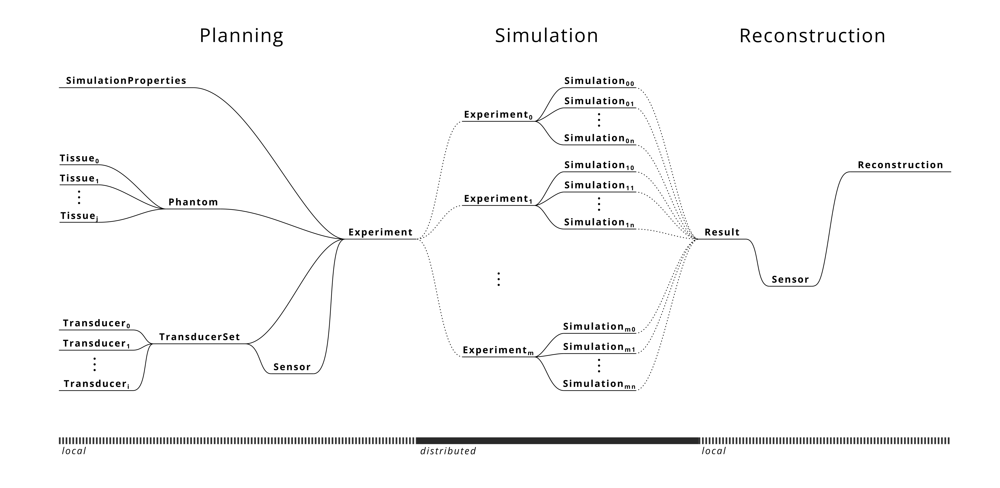

# MUSiK: Multi-transducer Ultrasound Simulations in K-wave



MUSiK is a Python library for simulating multi-transducer ultrasound systems using the k-Wave toolbox. It provides tools for creating phantoms, configuring transducers, running simulations, and processing results.

## Installation

### Prerequisites
- Python 3.10 (recommended to avoid dependency conflicts)
- Git
- GPU with CUDA support (recommended for faster simulations)

### Clone the Repository
```bash
# Clone the repository with submodules
git clone --recursive --remote-submodules git@github.com:norway99/MUSiK.git

# Navigate to the cloned directory
cd MUSiK
```

If you already cloned the repository without the `--recursive` flag, you can initialize the submodules with:
```bash
git submodule update --init --recursive --remote
```

### Setting up the Environment
```bash
# Create and activate a new conda environment (recommended)
conda create -n musik python=3.10
conda activate musik

# Install dependencies
pip install -r requirements.txt
```

#### Note on k-wave-python
The k-wave-python package is included as a submodule in this repository. Alternatively, you can install it directly with pip:
```bash
pip install k-wave-python
```

**Important**: When running k-wave for the first time, it needs to download some binaries which may cause issues in computing environments without internet access (e.g., HPC compute nodes). If necessary, prepare your environment by running a simple k-wave script on a node with internet access before running your full simulations. (this should happen automatically by running the start_here demo.)

## Getting Started

### Running the Introductory Demo
The repository includes an introductory demo that demonstrates the basic functionality of MUSiK:

1. Navigate to the demos/start_here directory:
```bash
cd demos/start_here
```

2. Open and run the intro_demo.ipynb notebook using Jupyter:
```bash
jupyter notebook intro_demo.ipynb
```

This notebook will guide you through:
- Creating a simple phantom with different tissue types
- Setting up a focused transducer
- Configuring simulation properties
- Running the ultrasound simulation
- Processing and visualizing the results

### Key Components

- **Phantom**: Define the geometry and material properties of the medium
- **Tissue**: Define acoustic properties of different materials
- **Transducer**: Configure ultrasound transducer specifications
- **TransducerSet**: Manage multiple transducers for complex setups
- **Sensor**: Define how signals are captured
- **Experiment**: Coordinate all components and manage the simulation workflow
- **Reconstruction**: Process simulation results to create images

## Running Multi-GPU Simulations

MUSiK supports distributing simulation workloads across multiple GPUs on a single node or local workstation, which can significantly reduce computation time for large experiments.

1. First, prepare your experiment as you would for any simulation:
```python
my_experiment = experiment.Experiment(
    simulation_path = 'my_simulation',
    sim_properties = my_simprops,
    phantom = my_phantom,
    transducer_set = my_transducer_set,
    sensor = my_sensor,
    nodes = N,  # Set N to the number of GPUs you want to use
    workers = 3,  # Number of CPU workers per GPU
    additional_keys = []
)
my_experiment.save()
```

2. To run the simulation across multiple GPUs, you can use the provided `run_multi_gpu.sh` script:
```bash
cd run
bash run_multi_gpu.sh my_simulation 4 3
```

Where:
- The first argument is the path to your saved experiment
- The second argument is the number of GPUs to use
- The third argument is the number of CPU workers per GPU (optional, defaults to 3)

This script will automatically launch the simulation across all specified GPUs, distributing the workload appropriately.

3. For manual control, you can also directly use the parallel.py script for each GPU:
```bash
# For GPU 0
python run/parallel.py -p my_simulation -n 0 -s 4 -g 1 -r 1 -w 3 &

# For GPU 1
python run/parallel.py -p my_simulation -n 1 -s 4 -g 1 -r 1 -w 3 &
```

Where:
- `-p, --path`: Path to the saved experiment directory
- `-n, --node`: The GPU index to use for this process
- `-s, --nodes`: Total number of GPUs to distribute the work across
- `-g, --gpu`: Whether to use GPU acceleration (1 for yes, 0 for no)
- `-r, --repeat`: Whether to repeat and overwrite previous results (1 for yes, 0 for no)
- `-w, --workers`: Number of CPU workers to use per GPU

## Running SLURM Array Jobs

For larger simulations, MUSiK provides tools to distribute computations across multiple nodes using SLURM:

1. Prepare your experiment by creating and saving an Experiment object:
```python
my_experiment = experiment.Experiment(
    simulation_path = 'my_simulation',
    sim_properties = my_simprops,
    phantom = my_phantom,
    transducer_set = my_transducer_set,
    sensor = my_sensor,
    nodes = 16,  # Number of nodes to distribute the work
    workers = 3,  # Number of CPU workers per node
    additional_keys = []
)
my_experiment.save()
```

2. Use the provided run.sh script to submit a SLURM job array:
```bash
cd run
bash run.sh --job-name my_simulation --output outputs/my_simulation_%A_%a.out --dir path/to/experiment/directory --nodes 16 --workers 3 --cuda 1 --time "2-00" --mem "64G" --repeat 0
```

Parameters:
- `--job-name`: Name for the SLURM job
- `--dir`: Path to the directory containing the saved experiment
- `--nodes`: Number of nodes to distribute the work (should match the experiment configuration)
- `--workers`: Number of CPU workers per node
- `--cuda`: Whether to use GPU acceleration (1 for yes, 0 for no)
- `--time`: Maximum job time in the format "days-hours"
- `--mem`: Memory allocation per GPU
- `--repeat`: Whether to repeat and overwrite previous results (1 for yes, 0 for no)
- `--output`: Path pattern for output logs

The SLURM job will create an array of tasks, with each task handling a portion of the simulation workload.

## Contact

For questions or assistance, please contact:
- Trevor Chan (tjchan@seas.upenn.edu)
- Aparna Nair-kanneganti

## Issues and Contributions

- For bug reports or feature requests, please open an issue on GitHub!
- Pull requests are welcome for code improvements or additional features!

## Citation

Please cite the following manuscript:
```
Chan TJ, Nair-Kanneganti A, Anthony B, Pouch A. MUSiK: An Open Source Simulation Library for 3D Multi-view Ultrasound. IEEE Trans Biomed Eng. 2025 Sep 4;PP. doi: 10.1109/TBME.2025.3605577. Epub ahead of print. PMID: 40907042.
```

## License

This project is licensed under the terms included in the LICENSE file.


